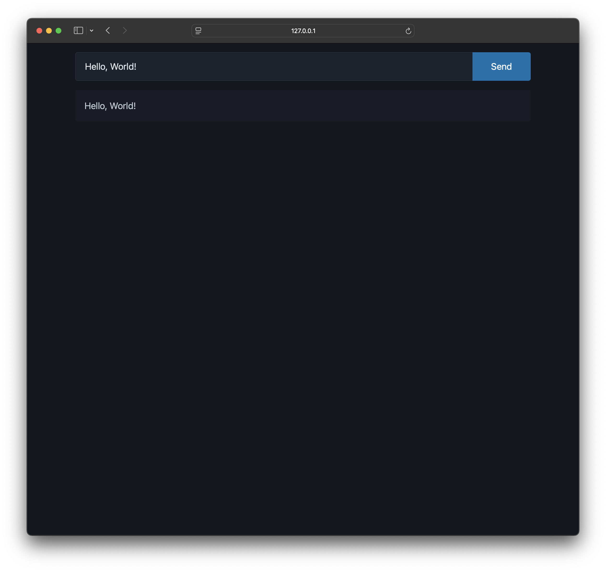
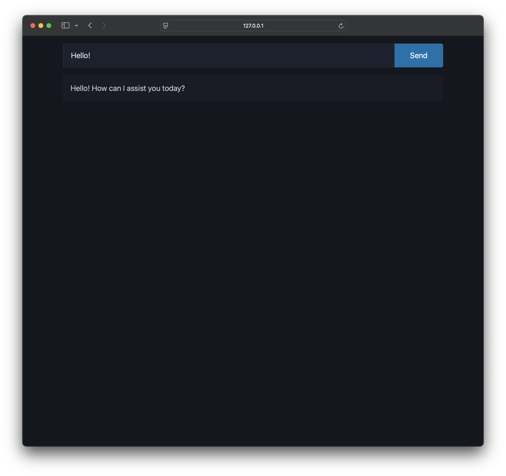
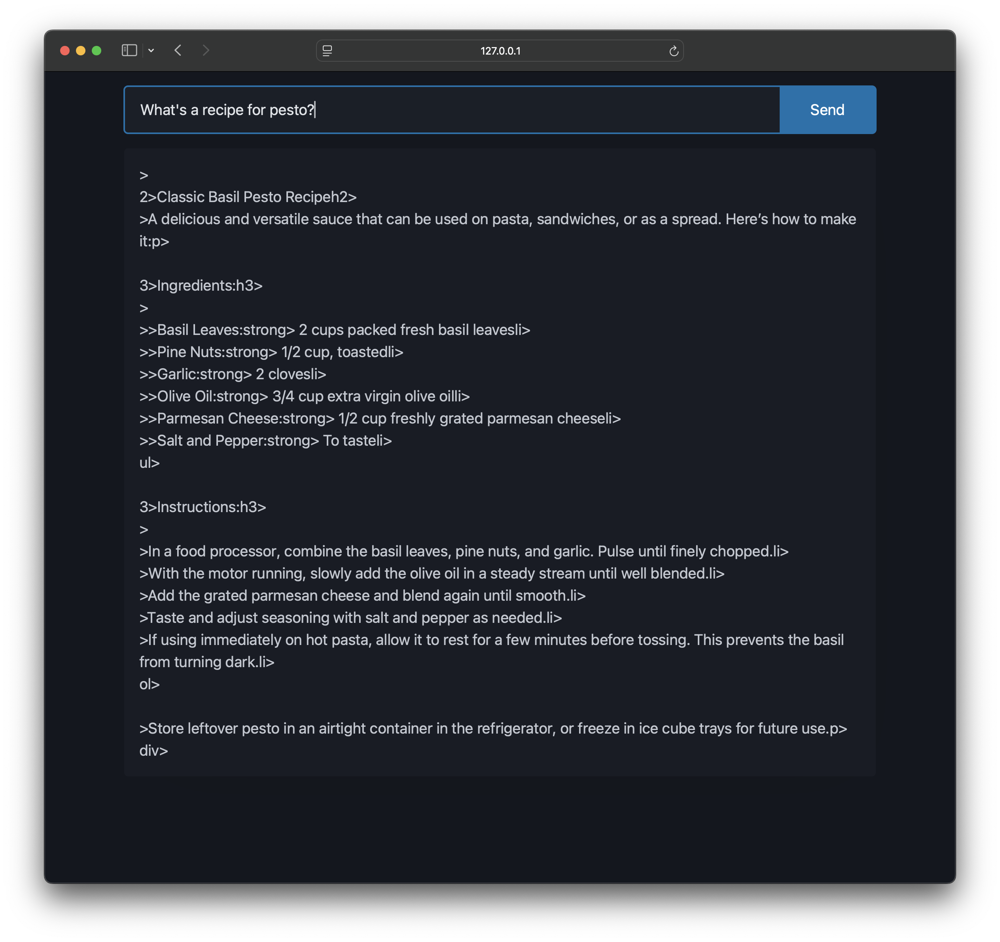
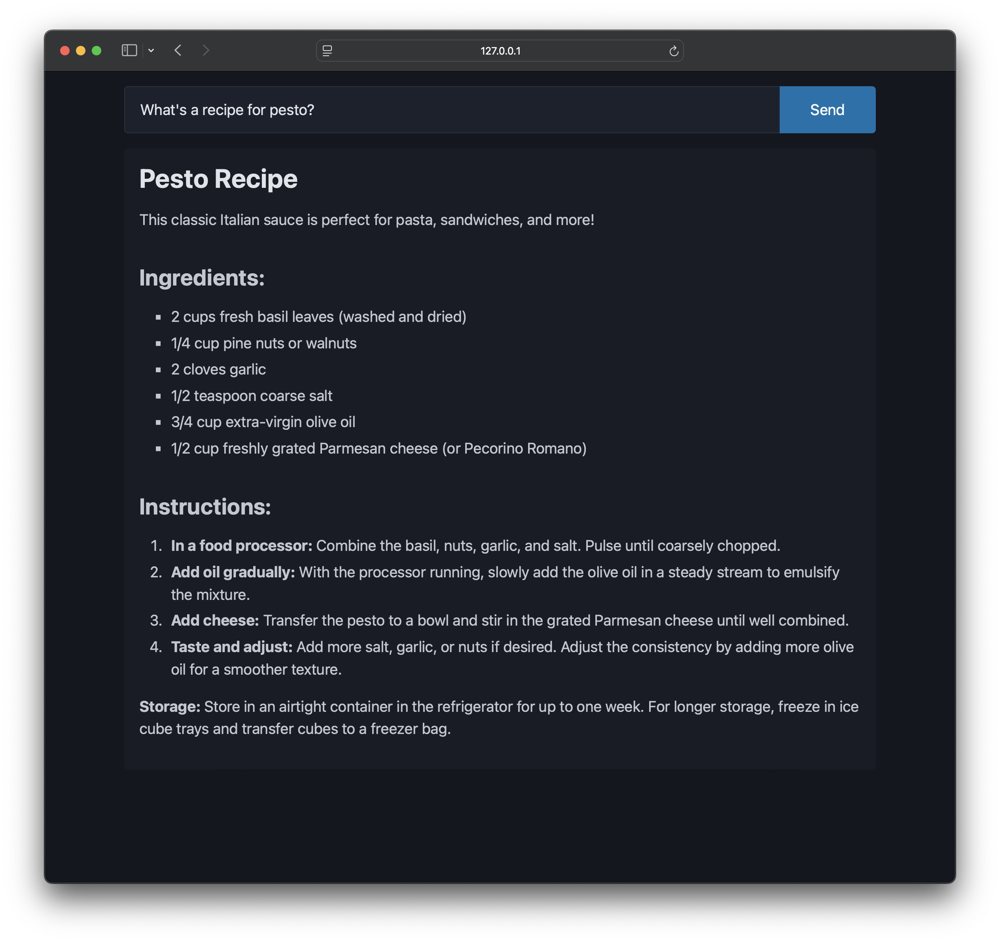

LLM-based chat interfaces like ChatGPT use **token streaming** to incrementally display generated text, rather than having users wait for the full response. This technique improves the user experience by reducing perceived latency, especially for lengthy outputs.[^1]

Token streaming can be easily implemented in server-driven web applications using [htmx](https://htmx.org), a library that enables dynamic interfaces using HTML attributes and [server-sent events](https://developer.mozilla.org/en-US/docs/Web/API/Server-sent_events) (SSE). This article demonstrates an example using Python and Flask, though htmx is backend-agnostic and can be used with any tech stack.

## Project setup

We'll incorporate token streaming into a simple chat app. Start by following the [Flask documentation](https://flask.palletsprojects.com/en/stable/installation/) to set up a new project. Then, create routes for a static page and form handler:

```python
# app.py
from flask import Flask, request

app = Flask(__name__)

@app.route("/")
def index():
    return app.send_static_file("index.html")


@app.post("/chat")
def chat():
    query = request.form["query"]
    return f"<article>{query}</article>"
```

```html
<!-- static/index.html -->
<!DOCTYPE html>
<html>
    <head>
        <meta charset="utf-8" />
        <meta name="viewport" content="width=device-width, initial-scale=1" />
        <meta name="color-scheme" content="light dark" />

        <!-- Load htmx and SSE extension -->
        <script src="https://unpkg.com/htmx.org@2.0.4"></script>
        <script src="https://unpkg.com/htmx-ext-sse@2.2.2"></script>
        <!-- Pico CSS for predefined styles -->
        <link rel="stylesheet" href="https://cdn.jsdelivr.net/npm/@picocss/pico@2/css/pico.classless.min.css" />
    </head>
    <body>
        <main>
            <!-- Form for sending queries to the `/chat` endpoint -->
            <form hx-post="/chat" hx-target="#answer">
                <fieldset role="group">
                    <input name="query" placeholder="Ask me anything" />
                    <input type="submit" value="Send" />
                </fieldset>
            </form>
            <!-- Container for receiving `/chat` response -->
            <div id="answer"></div>
        </main>
    </body>
</html>

```

The `<form>` sends queries to the `/chat` endpoint using `hx-post`, and the server responds with an HTML fragment that is swapped into the `#answer` target element.

Start the server using `flask run` and visit the site at the logged URL (e.g., `http://127.0.0.1:5000`). After submitting a query, the same text should appear on the page.



## Plain text streaming

To implement basic text streaming, start by updating the `/chat` handler:

```python
@app.post("/chat")
def chat():
    query = request.form["query"]
    return f"""
    <article hx-ext="sse"
        sse-connect="/stream?query={query}"
        sse-swap="token"
        hx-swap="beforeend scroll:bottom"
        sse-close="close"></article>
    """
```

The new fragment contains various attributes to initialize the token stream:

- `hx-ext` enables the htmx SSE extension.
- `sse-connect` specifies the streaming endpoint.
- `sse-swap` specifies the events to swap into the DOM.
- `hx-swap` appends each token into the current element and scrolls to the bottom.
- `sse-close` specifies the event that closes the stream.

We'll use [Ollama](https://ollama.com) to generate responses from a local LLM. Refer to the [Ollama documentation](https://github.com/ollama/ollama/blob/main/README.md#quickstart) to get started with your preferred model. Then, install the [Ollama Python library](https://github.com/ollama/ollama-python) and set up the `/stream` route:

```python
from flask import Flask, Response, request, stream_with_context
import ollama

# -- omitted -- #

prompt = "Answer the query in plain text"
model = "phi4"

@app.route("/stream")
def stream():
    def generate():
        stream = ollama.chat(
            model=model,
            messages=[
                {"role": "system", "content": prompt},
                {"role": "user", "content": request.args["query"]},
            ],
            stream=True,
        )

        for chunk in stream:
            token = chunk["message"]["content"].replace("\n", "<br>")
            yield server_sent_event("token", token)

        yield server_sent_event("close", "")

    return Response(stream_with_context(generate()), mimetype="text/event-stream")


def server_sent_event(event: str, data: str) -> str:
    return f"event: {event}\ndata: {data}\n\n"

```

The handler streams generated tokens to the client, wrapping each one with `server_sent_event()` to comply with the SSE specification[^2]. Server-sent events must end with `\n\n`, so newlines outputted by the model are replaced with `<br>` to prevent message truncation. Once all tokens are sent, a `close` message ends the stream.



## HTML streaming

To generate HTML instead of plain text, we can modify the prompt:

```python
prompt = "Answer the query in only HTML in a <div> fragment (never use full <html> or backticks)"
```

However, the output will unfortunately appear malformed.



The incomplete HTML tags aren't being correctly interpreted, even after subsequent tokens complete the element. A simple solution involves buffering the HTML client-side and re-rendering from the buffer, rather than appending directly to the DOM.

The updated server code disables `hx-swap` and adds improved newline handling for HTML:

```python
@app.post("/chat")
def chat():
    query = request.form["query"]
    # Disable htmx swapping with "hx-swap=none"
    return f"""
    <article hx-ext="sse"
        sse-connect="/stream?query={query}"
        sse-swap="token"
        hx-swap="none"
        sse-close="close"></article>
    """

@app.route("/stream")
def stream():
    def generate():
        # -- omitted -- #
        buffer = ""
        in_pre = False

        for chunk in stream:
            for token in chunk["message"]["content"]:
                # Add newlines only for <pre> blocks
                if token == "\n":
                    if in_pre:
                        token = "<br/>"
                else:
                    buffer += token

                if buffer.endswith("<pre>"):
                    in_pre = True
                if buffer.endswith("</pre>"):
                    in_pre = False

                yield server_sent_event("token", token)

        yield server_sent_event("close", "")

```

JavaScript listeners hook into htmx events to update the buffer and target element:

```html
<script>
    window.answer = ""; // Buffer for accumulating SSE data

    // Append tokens to buffer and re-render target element
    document.addEventListener("htmx:sseBeforeMessage", event => {
        answer += event.detail.data;
        event.detail.elt.innerHTML = answer;
    });

    // Reset the buffer after completion
    document.addEventListener("htmx:sseClose", () => (answer = ""));
</script>
```



The final code is available on [GitHub](https://gist.github.com/ritamsarmah/084c6ac7c374c17cd300cd9d211a6fe4). Further enhancements could include updating the DOM only when the buffer contains complete HTML tags to prevent flickering or using CSS transitions for smoother rendering.

[^1]: https://huggingface.co/docs/text-generation-inference/en/conceptual/streaming
[^2]: https://html.spec.whatwg.org/multipage/server-sent-events.html#server-sent-events
