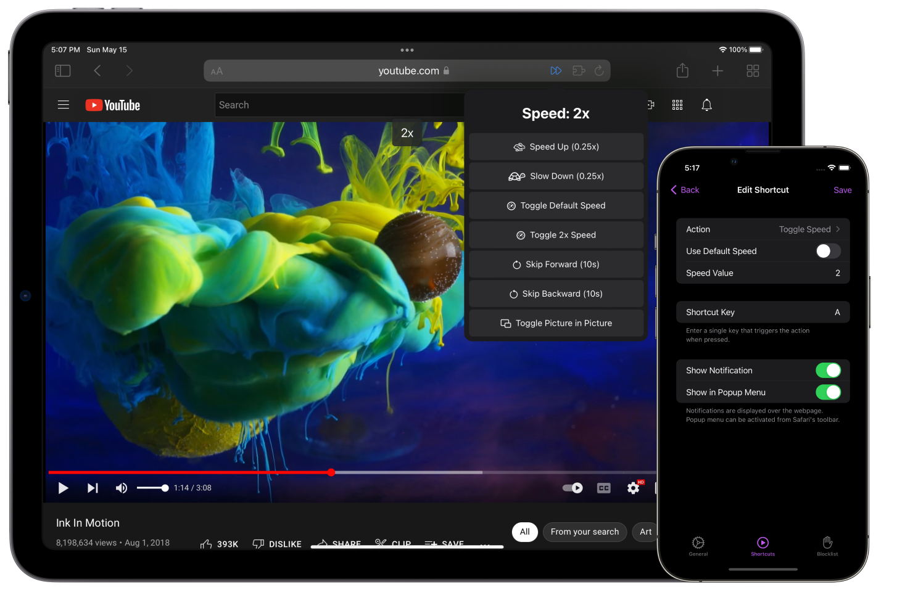

# Video playback controls for Safari

## Accelerate is a Safari extension for macOS and iOS with powerful, customizable features for controlling video playback.

Free and [open source](https://github.com/ritamsarmah/accelerate). Supports macOS 10.13+ and iOS 15+

## Adjust playback speed

Instantly speed up or slow down videos, allowing you to follow alongside tutorials, zoom through lectures, and boost your productivity.

## Keyboard shortcuts

Create convenient shortcuts that work across your favorite video websites, so you can easily control playback and toggle features like Picture-in-Picture.

## Extensive website support

Accelerate supports any website that uses HTML5 video, including YouTube, Netflix, Hulu, and more.

